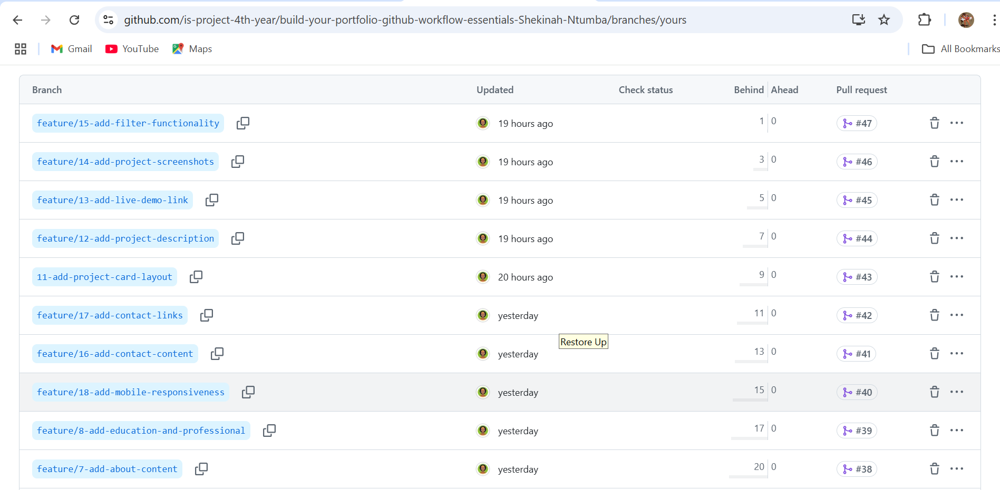
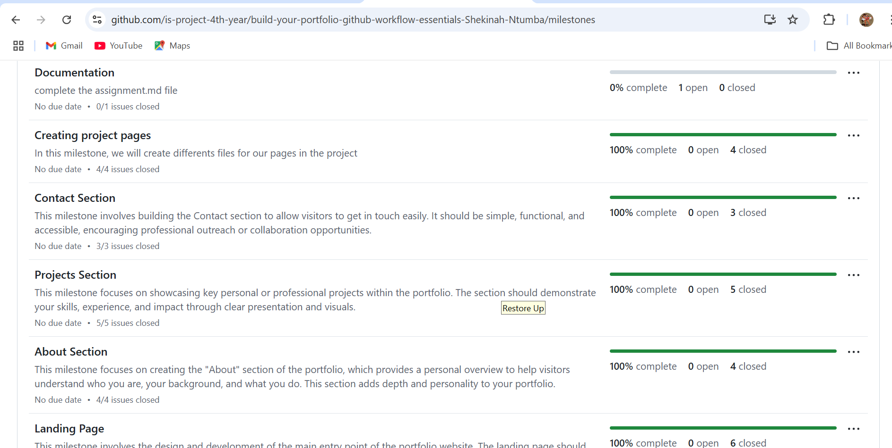
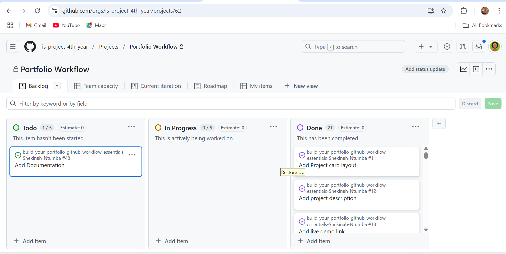
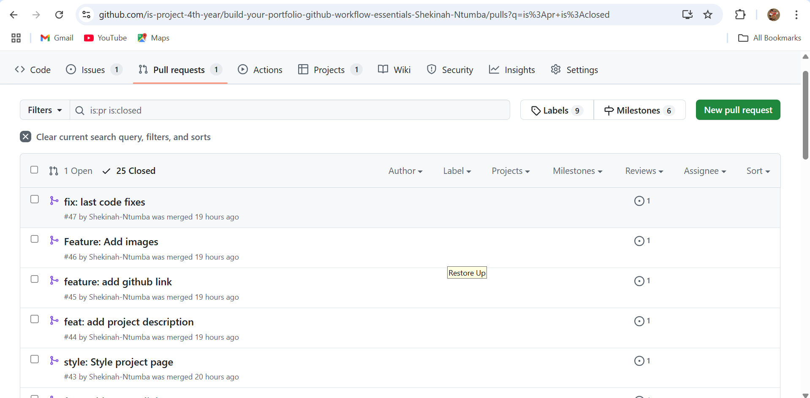

# Personal Portfolio Documentation

## 1. Student Details

- **Full Name**: Mpinguyabo Ntumba Shekinah
- **GitHub Username**: Shekinah-Ntumba
- **Email**: ntumba.mpinguyabo@strathmore.edu

## 2. Deployed Portfolio Link

- **GitHub Pages URL**:  
  https://github.com/Shekinah-Ntumba

## 3. Learnings from the Git Crash Program

**🧠 What I Thought I'd Learn vs What I Actually Learned**

**1. Concept: Merge Conflicts**

`Expectation 👀`: I thought merge conflicts only happen when multiple people work on the same project and edit the same file.  
`Reality 😅`: Nope—turns out I can fight with *myself* too. Even solo, I triggered merge conflicts just by switching branches and making changes without syncing properly.  
`Impact 💡`: I now understand how to resolve conflicts step by step, which helped when I was updating the navbar and footer on two branches in my portfolio. No more panic when Git shouts at me!

---

**2. Concept: Commit Messages**

`Expectation 👀`: I figured commit messages were just random notes like "final update" or "fix".  
`Reality 😅`: Good commit messages are like a diary for your code—they help track what happened, when, and why.  
`Impact 💡`: I started writing meaningful messages like “refactor contact form responsiveness” or “add mobile nav toggle,” which saved me time when I needed to undo something or check what I changed later.

---

**3. Concept: Issues and Milestones**

`Expectation 👀`: I thought GitHub Issues and Milestones were only for managing big collaborative projects or open-source work.  
`Reality 😅`: Turns out they’re super useful even when you’re working solo! I didn’t expect how satisfying and helpful it would be to track my own tasks that way.  
`Impact 💡`: I used Issues to break down my portfolio revamp into smaller to-dos—like "Fix mobile navbar" and "Add light/dark theme toggle." I created a Milestone to group them under “Version 2.0 Launch.” It gave me a real sense of progress and helped me stay organized.

---

**4. Concept: Pull Requests**

`Expectation 👀`: I thought pull requests were only for open-source projects or team work. No use for me.  
`Reality 😅`: Turns out PRs are also great for organizing and reviewing your own changes before merging—even solo!  
`Impact 💡`: I started using PRs to keep track of major updates in my personal project, like the portfolio theme redesign. It's like reviewing your own work with fresh eyes before it goes live.

## 4. Screenshots of Key GitHub Features

### A. Milestones and Issues

- Screenshot showing your milestone(s) and the issues linked to it:

### B. Project Board

- Screenshot of your GitHub Project Board with issues organized into columns (e.g., To Do, In Progress, Done):

### C. Branching

- Screenshot showing your branch list with meaningful naming:

### D. Pull Requests

- Screenshot of a pull request that’s either open or merged and linked to a related issue:

### E. Merge Conflict Resolution

- Screenshot of a resolved merge conflict (in a pull request, commit history, or your local terminal/GitHub Desktop).
